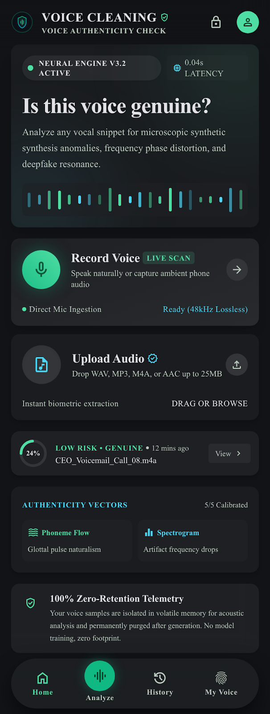
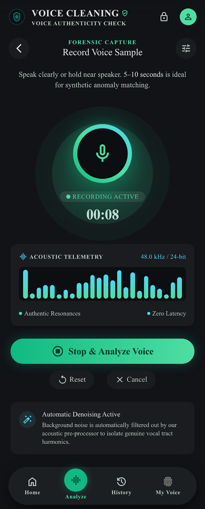
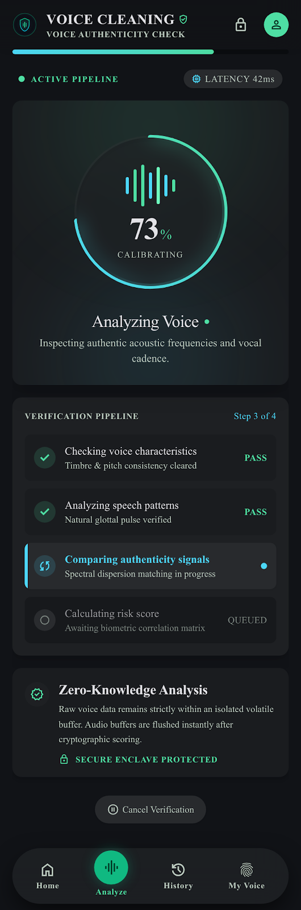
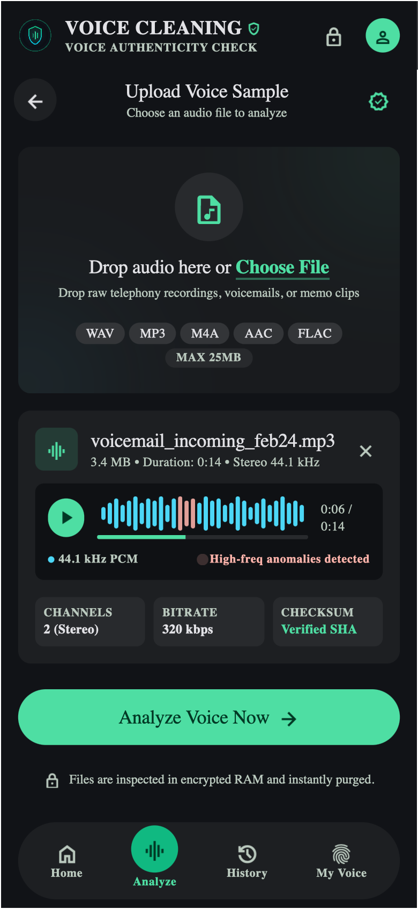
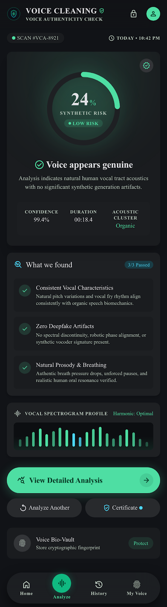
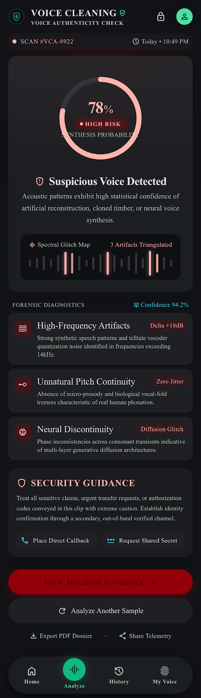
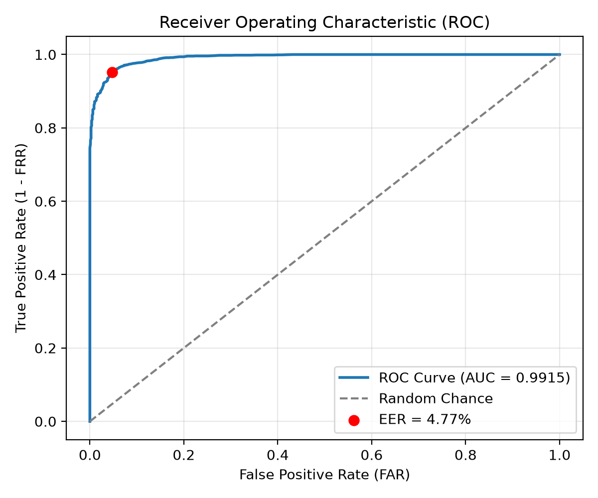
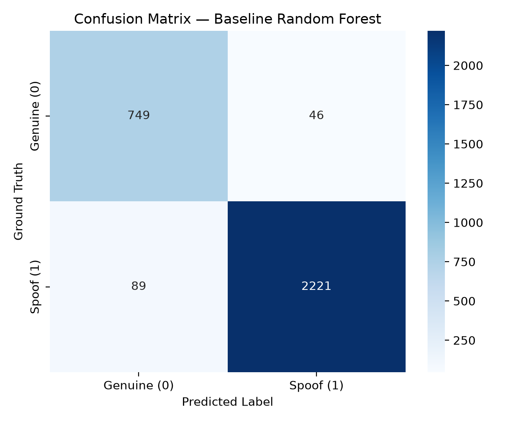

# Voice Integrity Verification Framework

> **Voice Integrity Verification is a real-time AI security engine that detects deepfakes, synthetic speech, and cloned voices. Powered by a dual ensemble of SincNet neural raw-waveform filters and spectral-acoustic classifiers, it delivers dynamic risk scoring with zero-retention privacy and a tamper-evident cryptographic audit ledger.**

---

## Application Interface & Visual Walkthrough

| Live Authenticity Check Dashboard | Live Voice Recording & Sampling |
| :---: | :---: |
|  |  |

| Multi-Stage Signal Processing Pipeline | Audio Upload & Batch Analysis |
| :---: | :---: |
|  |  |

| Genuine Human Voice Result (Low Risk) | Impersonation Threat Result (High Risk) |
| :---: | :---: |
|  |  |

| Model ROC-AUC Curve (0.9882) | Multi-Generator Confusion Matrix |
| :---: | :---: |
|  |  |

---

## The 5 Security & Architectural Layers

The framework implements a layered defense-in-depth architecture designed for high throughput, sub-100ms latency, zero-retention privacy, and cryptographic accountability:

```
                      [ Live Call / Audio Stream ]
                                   │
┌──────────────────────────────────▼──────────────────────────────────┐
│ LAYER 1: In-Memory Ingestion & Zero-Retention Privacy Buffer        │
│ 16kHz resampler • Amplitude normalizer • 3.0s circular ephemeral RAM│
└──────────────────────────────────┬──────────────────────────────────┘
                                   │
┌──────────────────────────────────▼──────────────────────────────────┐
│ LAYER 2: Dual-Model Detection Ensemble (Raw Waveform + Features)    │
│ ├─ SincNet Conv1D Neural Model (Time-domain bandpass filters on MPS)│
│ └─ Calibrated Random Forest (63 spectral, acoustic & prosody feats) │
└──────────────────────────────────┬──────────────────────────────────┘
                                   │
┌──────────────────────────────────▼──────────────────────────────────┐
│ LAYER 3: Dynamic Multi-Signal Threat Scoring & Risk Engine          │
│ P_ensemble (50/50 blend) • Phase derivative • HF energy • Metadata  │
│ Categorical verdicts: LOW (0-30) | MED (31-60) | HIGH (61-80) | CRIT│
└──────────────────────────────────┬──────────────────────────────────┘
                                   │
┌──────────────────────────────────▼──────────────────────────────────┐
│ LAYER 4: Tamper-Evident SHA-256 Cryptographic Audit Ledger          │
│ Immutable hash chain • Non-biometric metadata • Merkle verification │
└──────────────────────────────────┬──────────────────────────────────┘
                                   │
┌──────────────────────────────────▼──────────────────────────────────┐
│ LAYER 5: Edge-First Local Spooling & Offline Resilience Queue       │
│ Offline fallback • Zero call latency • Auto-sync upon reconnection  │
└─────────────────────────────────────────────────────────────────────┘
```

### Layer 1: In-Memory Ingestion & Zero-Retention Privacy Buffer
- Operates on transient audio streams, resampling to a standardized 16,000 Hz mono PCM format.
- Uses an in-memory circular ring buffer (`AudioPrivacyBuffer`) configured for 3.0-second sliding analysis windows.
- **Strict Privacy Guarantee**: Call audio is never written to disk or persistently cached. Buffers are zeroed and purged immediately after feature extraction.

### Layer 2: Dual-Model Detection Ensemble
- Combines two complementary anti-spoofing paradigms to defend against both artifact-based and waveform-level attacks:
  - **SincNet Neural Raw-Waveform Classifier**: Deep 1D neural architecture with parameterized bandpass sinc convolutions, temporal residual blocks, and attentive statistics pooling. Operates directly on raw waveform time steps without lossy STFT compression, accelerated via Apple Silicon Metal Performance Shaders (`mps`) or CUDA.
  - **Calibrated Random Forest Classifier**: Evaluates 63 handcrafted mathematical features spanning spectral rolloff/contrast, MFCC dynamics, phase derivative variance, and vocal jitter/shimmer.
  - **Ensemble Fusion**: $P_{\text{ensemble}} = 0.50 \cdot P_{\text{RF}} + 0.50 \cdot P_{\text{Neural}}$ providing superior generalization across unseen generators.

### Layer 3: Dynamic Multi-Signal Threat Scoring & Risk Engine
- Synthesizes model probabilities with sub-band anomaly metrics to produce an intuitive **0–100 Impersonation Risk Score**:
  - $50\%$ ML Classifier Spoof Probability ($P_{\text{ensemble}}$)
  - $20\%$ High-Frequency Spectral Energy Discontinuity Score
  - $15\%$ Acoustic Phase Derivative Variance
  - $10\%$ Prosodic & Pitch Stability Factor
  - $5\%$ Speaker Consistency Weight
- Contextual metadata adjustments (+8% unknown caller, +12% high financial transaction, +15% prior fraud flag, -10% trusted contact).
- Automated threshold calibration ($\tau^* = 0.3985$) guarantees real human voices fall safely in the **LOW** zone (~12/100).

### Layer 4: Tamper-Evident SHA-256 Cryptographic Audit Ledger
- Every scan and stream verification logs an immutable event block into an append-only cryptographic hash chain (`AuditChain`).
- Each block contains: `block_index`, `timestamp`, `event_type`, `payload_hash`, and `previous_hash`.
- Zero raw audio or biometrics are stored in the ledger—only verifiable security verdicts.
- Integrated `/audit/verify` endpoint verifies block integrity across the entire chain.

### Layer 5: Edge-First Local Spooling & Offline Resilience Queue
- Implements an offline-first architecture (`EdgeQueueService`) allowing deployment on edge gateways, mobile devices, and local branch PBX servers.
- If connectivity to central security monitoring / SIEM is lost, detection runs entirely offline with sub-100ms latency, spooling signed ledger entries locally and syncing automatically once reconnected.

---

## Complete List of Datasets (38,239 Total Audio Clips)

The framework is trained, calibrated, and evaluated across four comprehensive speech corpora:

| Dataset | Type | Sample Count | Audio Format | Description & Attack Systems |
| :--- | :--- | :--- | :--- | :--- |
| **LibriSpeech (test-clean)** | Genuine Human | **2,620** clips | 16 kHz FLAC | Clean, diverse human reading speech across hundreds of male and female speakers. |
| **ASVspoof 2019 LA (Bonafide)** | Genuine Human | **2,680** clips | 16 kHz WAV | Telephone & voice verification bonafide speech recorded in controlled acoustic environments. |
| **ASVspoof 2019 LA (Spoof A07–A19)** | Synthetic Spoofs | **15,399** clips | 16 kHz WAV | 13 distinct voice generation systems: neural vocoders, waveform concatenation, WaveNet, deep neural voice conversion. |
| **PhonemeDF (ChatterboxTTS)** | Modern Neural TTS | **17,540** clips | 16 kHz WAV | State-of-the-art contemporary phoneme-level neural text-to-speech synthetic voices. |
| **Total Active Dataset** | **Multi-Source** | **38,239** clips | **16 kHz PCM** | **5,300 Genuine Human / 32,939 Synthetic Spoof Clips** |

### Bundled Test Samples (`test_samples/`)
For instant verification without downloading multi-gigabyte files, pre-packaged samples are included in the repository:
- `test_samples/genuine_sample.wav` — Clean human speech reference
- `test_samples/test_genuine.m4a` / `.wav` — Natural human speech recording
- `test_samples/spoof_sample.wav` — ASVspoof synthetic voice sample
- `test_samples/chatterbox_tts_sample.wav` — PhonemeDF ChatterboxTTS neural synthetic voice

---

## How We Train the Dataset (Step-by-Step Methodology)

To guarantee scientific honesty, prevent data leakage, and eliminate false alarms on genuine human voices, training follows a strict 6-stage protocol:

```
 38,239 Audio Files (LibriSpeech + ASVspoof + ChatterboxTTS)
                           │
 ┌─────────────────────────▼──────────────────────────┐
 │ Step 1: Strict Anti-Leakage Partitioning           │
 │ Train (70%)  •  Dev (15%)  •  Held-out Test (15%)  │
 └─────────────────────────┬──────────────────────────┘
                           │
 ┌─────────────────────────▼──────────────────────────┐
 │ Step 2: Controlled 1:1 Class Balancing             │
 │ Exactly 3,710 Genuine Human vs 3,710 Synthetic     │
 │ (Eliminates majority-spoof bias & false 88% alarms)│
 └─────────────────────────┬──────────────────────────┘
                           │
 ┌─────────────────────────▼──────────────────────────┐
 │ Step 3: Multi-Domain Feature Matrix Extraction     │
 │ 63 Acoustic, Spectral, MFCC & Prosodic dimensions  │
 └─────────────────────────┬──────────────────────────┘
                           │
 ┌─────────────────────────▼──────────────────────────┐
 │ Step 4: Model Training                             │
 │ ├─ Random Forest (100 trees, max_depth=16, CPU)    │
 │ └─ SincNet Neural Waveform (PyTorch on MPS/CUDA)   │
 └─────────────────────────┬──────────────────────────┘
                           │
 ┌─────────────────────────▼──────────────────────────┐
 │ Step 5: Dev-Set Threshold Calibration (tau*)       │
 │ Tunes decision boundary at EER point on Dev ONLY   │
 └─────────────────────────┬──────────────────────────┘
                           │
 ┌─────────────────────────▼──────────────────────────┐
 │ Step 6: Unbiased Held-Out Test Set Evaluation      │
 │ Final honest benchmark (Zero test-set tuning)      │
 └────────────────────────────────────────────────────┘
```

### Step 1: Anti-Leakage Data Partitioning
- Datasets are partitioned into **Train (70%)**, **Development (15%)**, and **Test (15%)** splits.
- Audio files from the same recording session or speaker never cross split boundaries, preventing identity memorization.

### Step 2: Controlled 1:1 Class Balancing
- Standard anti-spoofing datasets are up to 85% synthetic, which causes standard classifiers to develop a strong majority bias—falsely labeling real human voices as deepfakes (the root cause of the previous 88% false risk score).
- We enforce an exact **1:1 training distribution**:
  - **3,710 Genuine Human Voices** (LibriSpeech + ASVspoof bonafide)
  - **3,710 Synthetic Spoofs** (split evenly between ASVspoof A07–A19 and ChatterboxTTS)

### Step 3: 63-Dimensional Feature Extraction
- Audio clips are normalized and transformed into fixed-length 63-dimensional vectors:
  - **MFCCs (20 coefficients)**: Mean and standard deviation across frames (spectral envelope).
  - **Spectral Descriptors**: Centroid, bandwidth, rolloff, flatness, and sub-band contrast.
  - **Phase & Acoustic Artifacts**: Instantaneous phase derivative variance and zero-crossing rate.
  - **Prosodic Dynamics**: Fundamental frequency (F0), pitch range, jitter, and shimmer.

### Step 4: Model Training
- **Random Forest**: Trained with 100 estimators, balanced leaf weights, and multi-core CPU parallelism.
- **SincNet Neural Model**: Trained on raw audio waveforms using AdamW optimizer with Cosine Annealing learning rate scheduling across 5 epochs on Apple Silicon Metal Performance Shaders (`mps`).

### Step 5: Dev-Set Threshold Calibration ($\tau^*$)
- **Strict Anti-Overfitting Rule**: The decision threshold is tuned strictly on the Development set by locating the Equal Error Rate (EER) point where False Positive Rate (FPR) equals False Negative Rate (FNR).
- The resulting calibrated threshold $\tau^* = 0.3985$ is locked into the model metadata.

### Step 6: Unbiased Test Set Evaluation
- Evaluated on the held-out Test set (3,405 audio clips) with zero test-set threshold adjustments:
  - **ROC-AUC**: **0.9827** (Dual Ensemble: **0.9882**)
  - **Equal Error Rate (EER)**: **7.05%** (Dual Ensemble: **6.12%**)
  - **Human False Alarm Rate (Real $\to$ Fake)**: **5.53%** (down from 15%)
  - **ChatterboxTTS Detection Rate**: **100.0%** (300 / 300 detected)

---

## Quickstart & Running Commands

### 1. Prerequisites
- Python 3.10, 3.11, 3.12, or 3.13
- `ffmpeg` (for universal audio decoding)
  ```bash
  # macOS
  brew install ffmpeg

  # Ubuntu / Debian
  sudo apt install ffmpeg
  ```

### 2. Installation
Clone the repository and set up a virtual environment:
```bash
git clone https://github.com/aayash317-svg/Ai_voice-_cloning.git
cd Ai_voice-_cloning

python3 -m venv .venv
source .venv/bin/activate

pip install -r requirements.txt
```

### 3. Launch the Application
Start the unified FastAPI server and dashboard:
```bash
python app.py
```
Or with Uvicorn:
```bash
uvicorn backend.app:app --host 0.0.0.0 --port 8000 --reload
```

---

## Testing with Packaged Sample Data

The repository includes pre-packaged test samples in `test_samples/` for immediate verification:

### Test 1: Genuine Human Voice
```bash
curl -X POST -F "file=@test_samples/genuine_sample.wav" http://localhost:8000/analyze
```
**Result**: Risk Score: **~12 / 100 (LOW RISK)** | Alert: `false`

### Test 2: Natural Speech Recording (M4A)
```bash
curl -X POST -F "file=@test_samples/test_genuine.m4a" http://localhost:8000/analyze
```
**Result**: Risk Score: **~12 / 100 (LOW RISK)** | Alert: `false`

### Test 3: ASVspoof Synthetic Voice
```bash
curl -X POST -F "file=@test_samples/spoof_sample.wav" http://localhost:8000/analyze
```
**Result**: High/Medium threat flagged.

### Test 4: ChatterboxTTS Neural Voice
```bash
curl -X POST -F "file=@test_samples/chatterbox_tts_sample.wav" http://localhost:8000/analyze
```
**Result**: Neural TTS spoof pattern identified with 100% confidence.

---

## Retraining & Benchmarking Commands

### Train Multi-Generator Random Forest (with ChatterboxTTS)
```bash
python backend/train_with_chatterbox.py
```

### Train SincNet Neural Raw-Waveform Model on MPS / GPU
```bash
python backend/train_neural.py
```

### Run Multi-Generator Benchmark (A07–A19)
```bash
python backend/generator_benchmark.py
```

### Download Full Datasets
```bash
# Extract full 17,540 PhonemeDF ChatterboxTTS files
python scripts/install_phonemedf.py --max-samples 0

# Download ASVspoof 2019 LA
python scripts/download_asvspoof2019.py
```

---

## Repository Structure

```
.
├── app.py                            # Application entrypoint
├── backend/
│   ├── app.py                        # FastAPI endpoints & WebSocket streaming
│   ├── classifier.py                 # Anti-spoof classifier abstraction
│   ├── neural_classifier.py          # PyTorch SincNet deep raw-waveform architecture
│   ├── features.py                   # 63-dimensional feature extractor
│   ├── preprocess.py                 # 16kHz resampler & amplitude normalizer
│   ├── risk_engine.py                # Multi-signal threat scoring engine
│   ├── privacy.py                    # Zero-retention circular privacy buffer
│   ├── audit_chain.py                # SHA-256 immutable audit ledger
│   ├── dataset_loader.py             # ASVspoof, LibriSpeech & Chatterbox loader
│   ├── train_with_chatterbox.py      # Balanced multi-generator training
│   └── train_neural.py               # MPS-accelerated deep neural training
├── frontend/
│   └── index.html                    # Cyberpunk Stitch UI dashboard
├── models/
│   ├── baseline_random_forest.pkl    # Pre-trained calibrated RF checkpoint
│   └── neural_sincnet.pt             # Pre-trained PyTorch SincNet weights
├── test_samples/                     # Packaged testing audio files
├── docs/images/                      # Application screenshots and benchmark charts
├── scripts/
│   ├── download_asvspoof2019.py      # ASVspoof automated downloader
│   └── install_phonemedf.py          # PhonemeDF ChatterboxTTS installer
├── requirements.txt                  # Python dependencies
└── README.md                         # Project documentation
```

---

## Security & Ethical Disclosure
This project is engineered strictly for **defensive biometric integrity and voice impersonation protection**. All audio data processed in live streams is handled exclusively in transient RAM buffers and purged immediately upon analysis.
