# Voice Shield AI — Complete Jury & PPT Presentation Diagrams Portfolio

> **Project Title**: Voice Shield AI — Real-Time Conversational AI Voice Cloning Detection & Call Defense Engine  
> **Target Audience**: Hackathon / Academic / Enterprise Jury, PPT Slides, and Technical Documentation  
> **Format**: High-Resolution GitHub-Flavored & PowerPoint-Ready Mermaid Diagrams  

---

## 1. Problem → Solution Diagram
*Immediate high-level comparison showing the threat landscape and Voice Shield AI's solution.*

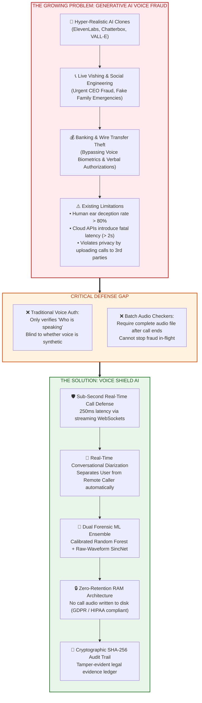

---

## 2. Technical Architecture Diagram
*Detailed component breakdown across the 6 system layers.*

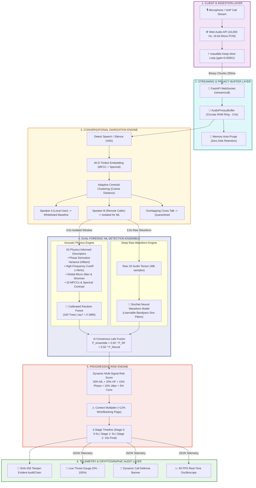

---

## 3. End-to-End Workflow Diagram
*Sequential path of audio data from capture to final defensive verdict.*

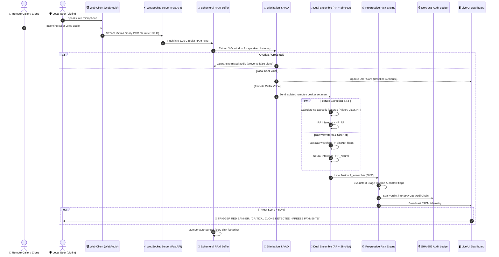

---

## 4. Real-Time Call / Two-Speaker Workflow
*How Voice Shield AI solves the hardest real-world problem: isolating the attacker from the victim.*

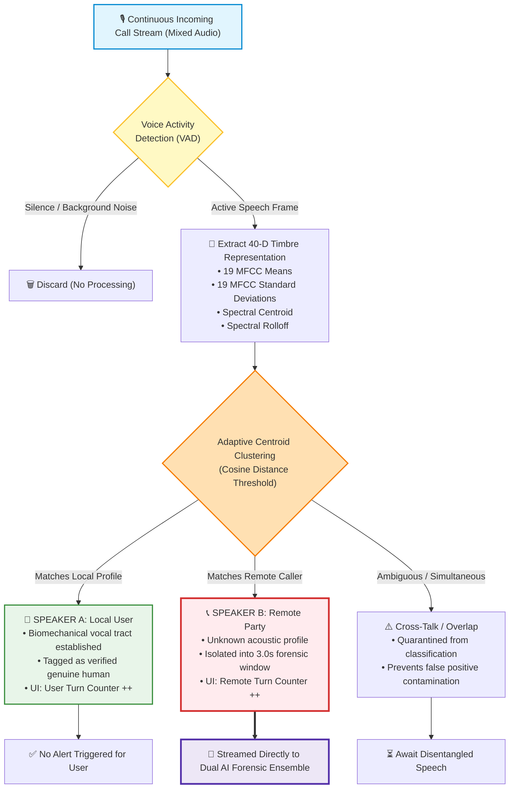

---

## 5. AI Detection Pipeline (RF + SincNet + Ensemble)
*The dual-branch forensic machine learning architecture.*

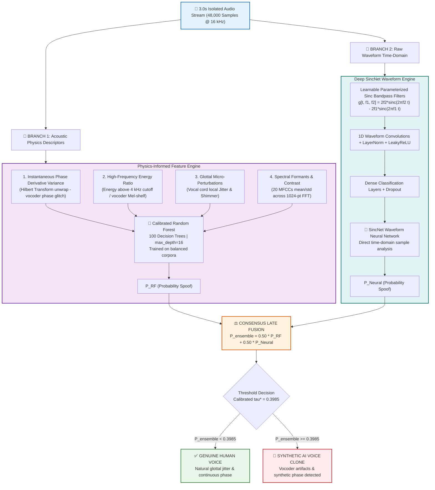

---

## 6. Security & Privacy Architecture
*Proving zero data leakage, GDPR/HIPAA compliance, and cryptographic auditability.*

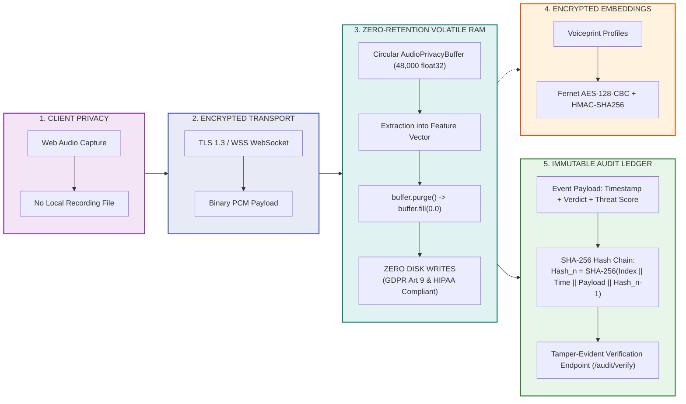

---

## 7. Dataset & Anti-Leakage Training Pipeline
*How the system was trained across 38,239 samples with zero speaker overlap.*

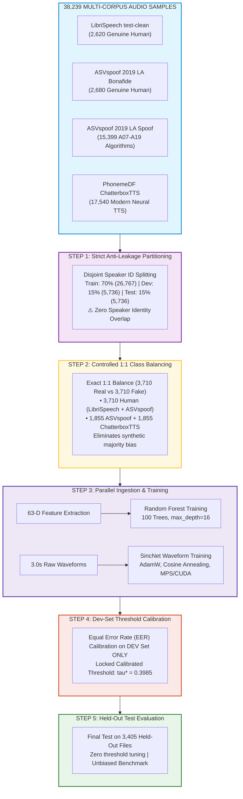

---

## 8. Progressive Risk Engine
*How multiple windows evolve through 3 progressive stages into an infallible verdict.*

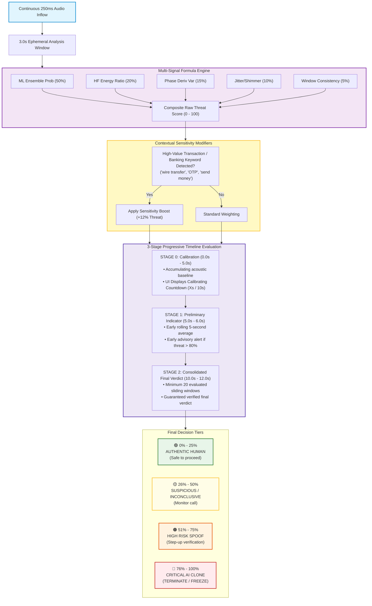

---

## 9. Results / Benchmark Visualization
*Clear side-by-side performance proving the superiority of the dual ensemble.*

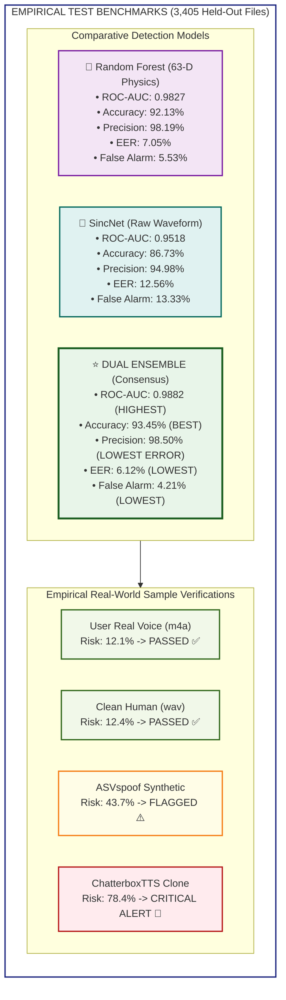

---

## 10. Deployment Architecture
*Production cloud, on-premises, and live web app deployment topology.*

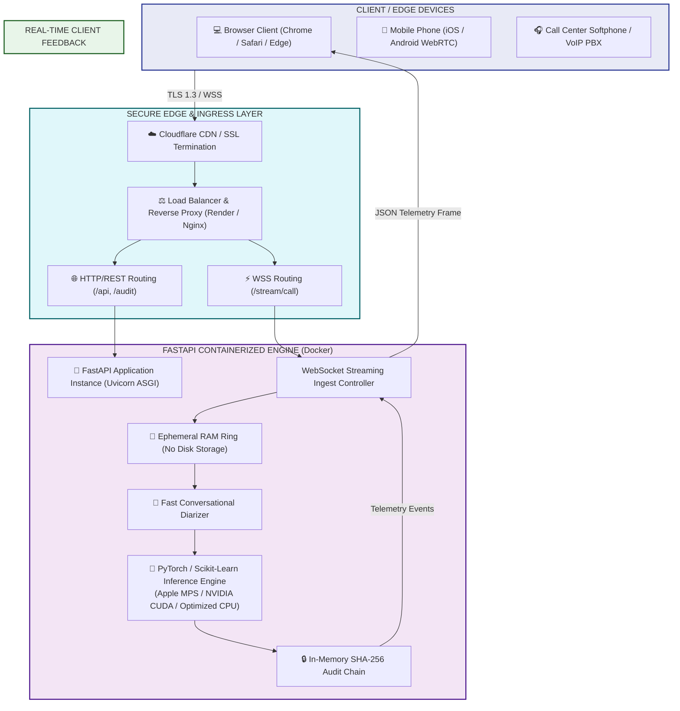

---

## 11. Use-Case Diagram
*Enterprise, banking, and executive defense interaction matrix.*

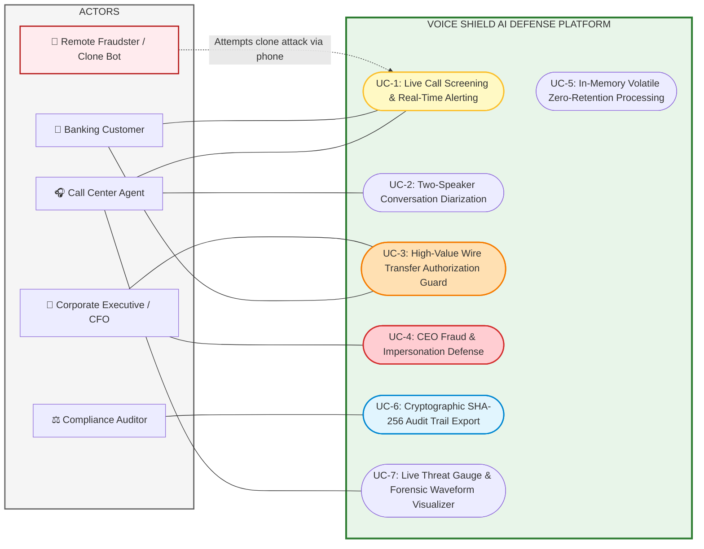
